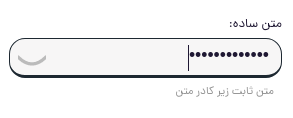
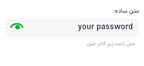

# jb-password-input-react

[](https://www.webcomponents.org/element/jb-password-input)
[](https://raw.githubusercontent.com/javadbat/jb-password-input/main/LICENSE)
[](https://www.npmjs.com/package/jb-password-input-react)


password input react component
this component props and functionality are all come from [jb-input-react](https://github.com/javadbat/jb-input-react) just for password input so for doc just read jb-input-react document
in jb-time-input you can create a input special for time the advantage is:

- all jb-input benefits include customizations, validation,...
- show password toggle button to let user see inputted password
- ready to use password validation like minimum length.

## Demo

 - [codeSandbox preview](https://3f63dj.csb.app/samples/jb-password-input) for just see the demo and [codeSandbox editor](https://codesandbox.io/p/sandbox/jb-design-system-3f63dj?file=%2Fsrc%2Fsamples%2FJBPasswordInput.tsx) if you want to see and play with code
 - [Storybook](https://javadbat.github.io/design-system/?path=/docs/components-form-elements-inputs-jbpasswordinput)

## Demo image:    



## set minimum length

```jsx
<JBPasswordInput minLength={8}></JBPasswordInput>
```
You can also set your own validation but we put this option for ease of use.

## Other Related Docs:

- see [jb-password-input](https://github.com/javadbat/jb-password-input) if you want to use this as a web-component in a pure-js app or any other framework.

- see [All JB Design system Component List](https://javadbat.github.io/design-system/) for more components.

- use [Contribution Guide](https://github.com/javadbat/design-system/blob/main/docs/contribution-guide.md) if you want to contribute in this component.
